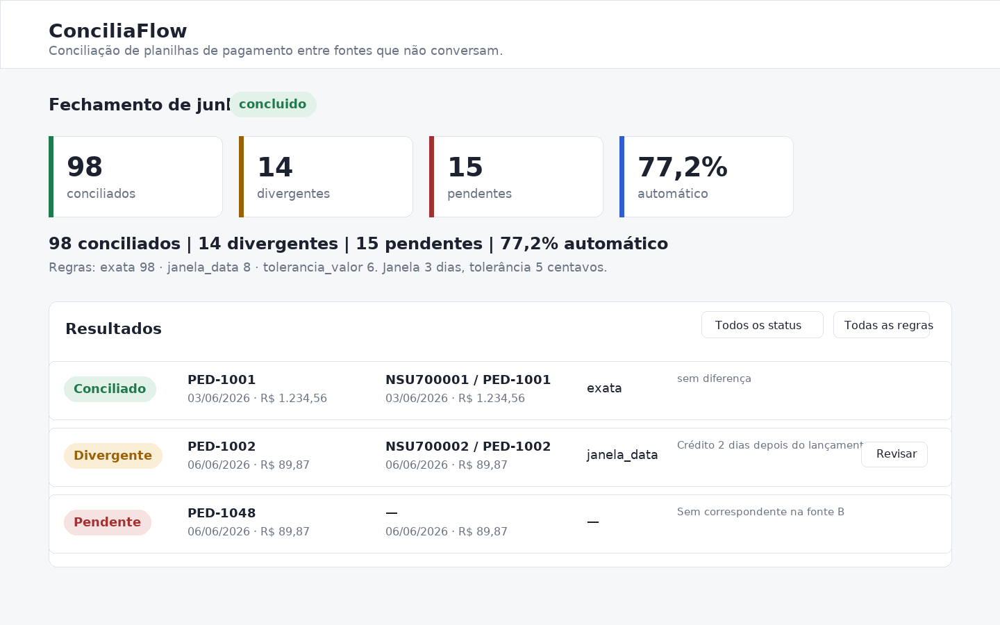
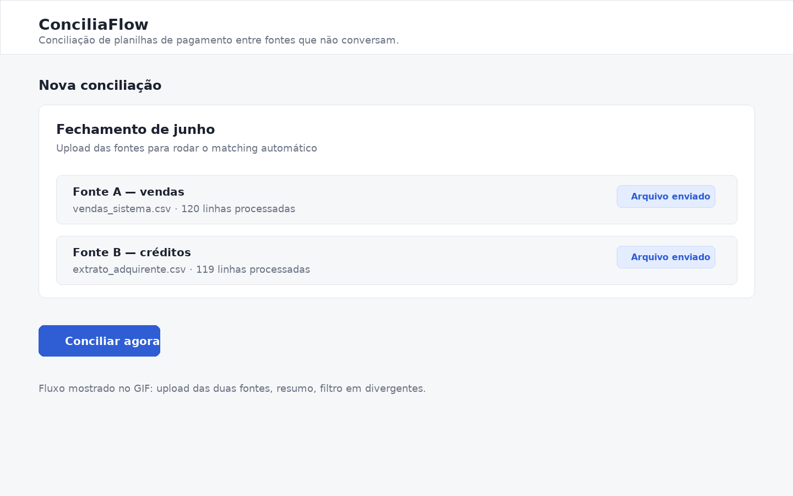

# ConciliaFlow

Reconciliação automática de planilhas de vendas e créditos para fechar lotes
sem conferência manual linha a linha.





## Problema

Uma operação de e-commerce precisa conciliar **120 vendas x 119 créditos**
toda semana em Excel. Os arquivos vêm com cabeçalhos, formatos de data,
separadores e padrões de valor diferentes. O resultado manual é previsível:

- 4 a 6 horas de retrabalho
- divergência sem rastreabilidade
- fechamento dependente de uma pessoa que entende a planilha
- sobras sem clareza do que foi pago, atrasado ou digitado errado

## Solução

O ConciliaFlow recebe os dois arquivos, normaliza os dados e roda três regras
determinísticas de matching:

1. `exata`: valor + referência + data
2. `janela_data`: mesmo valor, crédito até 3 dias depois
3. `tolerancia_valor`: mesma referência, diferença de até R$ 0,05

A interface web permite:

- criar uma execução de conciliação
- enviar CSV ou XLSX para a fonte de vendas e para a fonte de créditos
- rodar a conciliação e ver o resumo consolidado
- filtrar os matches por `conciliado`, `divergente` ou `pendente`
- exportar o resultado em CSV no formato que o Excel em português abre direto

Linhas ilegíveis não são descartadas: entram marcadas com `parse_error` para a
equipe corrigir a planilha e reenviar.

## Stack

- **Backend:** Python 3.12, FastAPI, SQLAlchemy 2.0, PostgreSQL
- **Frontend:** HTML, CSS e JavaScript servidos pela própria API FastAPI
- **Motor:** 3 regras determinísticas de matching
- **Dados demo:** gerador versionado com semente fixa
- **Testes:** pytest em SQLite local

## Resultado

Dataset de demonstração, conferido por teste automatizado:

- **98 conciliados**
- **14 divergentes**
- **15 pendentes**
- **77,2% de conciliação automática**

Esse número é **reproduzível**, não estimado. Ele sai do teste do dataset
fictício em [`demo/GABARITO.md`](demo/GABARITO.md).

Fluxo demonstrado na interface: upload dos dois arquivos, resumo de resultado,
filtro de divergentes e exportação CSV. A tela fica em `http://localhost:8000/`
e a documentação da API em `http://localhost:8000/docs`.

## Como usar

### Com Docker

```bash
git clone https://github.com/TrveLeo/conciliaflow.git
cd conciliaflow
cp .env.example .env
docker-compose up -d
```

### Sem Docker

```bash
python -m venv .venv
.venv/bin/pip install -r requirements.txt
.venv/bin/uvicorn app.main:app --reload
```

Abra `http://localhost:8000/`.

### Dataset de demonstração

```bash
python scripts/generate_demo_data.py --out demo/
```

Arquivos gerados:

- `demo/vendas_sistema.csv`
- `demo/extrato_adquirente.csv`
- `demo/GABARITO.md`

## Endpoints principais

| Método | Rota | Uso |
|---|---|---|
| `POST` | `/jobs/` | cria a execução |
| `POST` | `/jobs/{id}/upload/{a\|b\|c}` | envia e importa o arquivo |
| `POST` | `/jobs/{id}/reconcile` | roda a conciliação |
| `GET` | `/jobs/{id}/summary` | devolve o resumo consolidado |
| `GET` | `/jobs/{id}/matches` | lista os pares com filtros |
| `GET` | `/jobs/{id}/export.csv` | baixa o CSV final |

## Para usar em produção

- configurar PostgreSQL persistente
- definir variáveis de ambiente no `.env`
- publicar a API em um host com volume para armazenar uploads
- manter o dataset demo separado de qualquer dado real

## Testes

```bash
.venv/bin/python -m pytest
```

A suíte roda localmente sem banco externo. Um dos testes sobe o dataset demo
inteiro e valida exatamente os números usados neste README.
